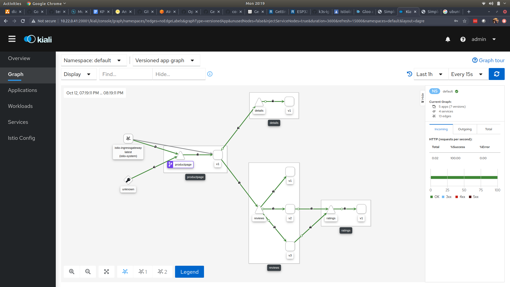

# Installing istio and gloo on k3s


## Install k3s, helm and glooctl
```
yum install -y which
yum install -y curl
curl -sfL https://get.k3s.io |INSTALL_K3S_EXEC="--no-deploy traefik" sh -
export KUBECONFIG=/etc/rancher/k3s/k3s.yaml 
yum install -y openssl
curl https://raw.githubusercontent.com/helm/helm/master/scripts/get-helm-3 | bash
curl -sL https://run.solo.io/gloo/install | sh
export PATH=$HOME/.gloo/bin:$PATH
```

## Install istio and deploy bookinfo sample app
```
curl -L https://istio.io/downloadIstio | ISTIO_VERSION=1.6.6 sh -
cd istio-1.6.6
export PATH="$PATH:/root/istio-1.6.6/bin"
istioctl install --set profile=demo
kubectl get po --all-namespaces
kubectl label namespace default istio-injection=enabled
kubectl apply -f samples/bookinfo/platform/kube/bookinfo.yaml
```
## Install gloo gateway using helm
```
kubectl create ns gloo-system
helm repo add gloo https://storage.googleapis.com/solo-public-helm
helm repo update
helm install --namespace gloo-system --version 1.5.0-beta25 gloo gloo/gloo
```

## Modify gateway-proxy service to use 8080 and 8443 to avoid conflict with istio-ingressgateway
```
kubectl edit svc gateway-proxy -n gloo-system
glooctl check
glooctl proxy url
```

## Configure gloo's gateway-proxy to use SDS server and establisth mTLS with istio upstream ( https://docs.solo.io/gloo/latest/guides/integrations/service_mesh/gloo_istio_mtls/ )
```
glooctl istio inject
kubectl get po -n gloo-system

glooctl istio enable-mtls --upstream default-productpage-9080

cat <<EOF | kubectl apply -f -
apiVersion: "security.istio.io/v1beta1"
kind: "PeerAuthentication"
metadata:
  name: "productpage"
  namespace: "default"
spec:
  selector:
    matchLabels:
      app: productpage
  mtls:
    mode: STRICT
EOF
```

## Add route and access productpage via gloo's gateway-proxy (envoy)
```
glooctl add route --name prodpage --namespace gloo-system --path-prefix / --dest-name default-productpage-9080 --dest-namespace gloo-system

glooctl get virtualservice

curl -v $(glooctl proxy url)/productpage
```
## Deploy the istio gateway and virtual service to access product page via istio-ingressgateway
```
kubectl apply -f samples/bookinfo/networking/bookinfo-gateway.yaml 
kubectl get svc istio-ingressgateway -n istio-system
curl <external-ip-of-istio-ingressgateway>/productpage
```

## Modify kiali service definition to use LoadBalancer instead of ClusterIP
```
kubectl edit svc kiali -n istio-system
kubectl get svc -n istio-system
```

## Visualize the two ingress path using kiali
