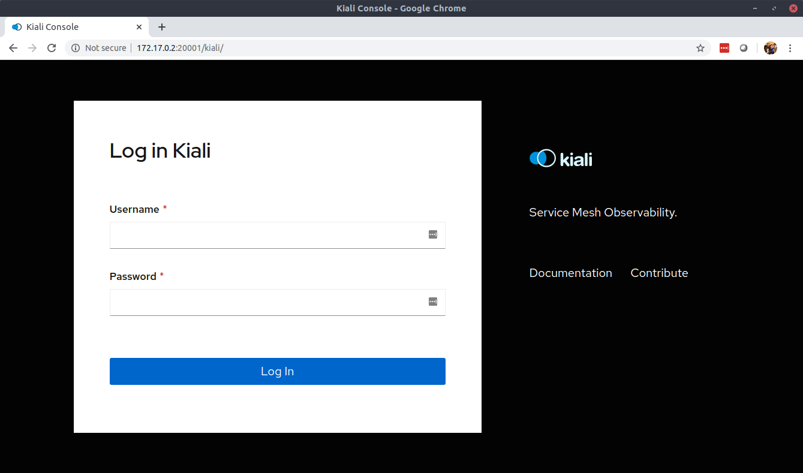
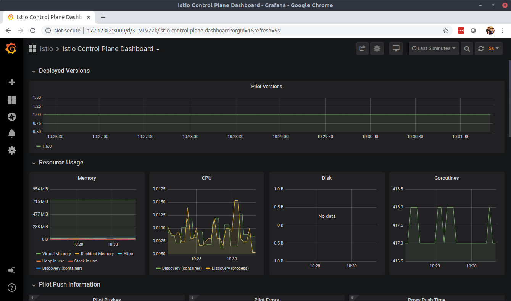
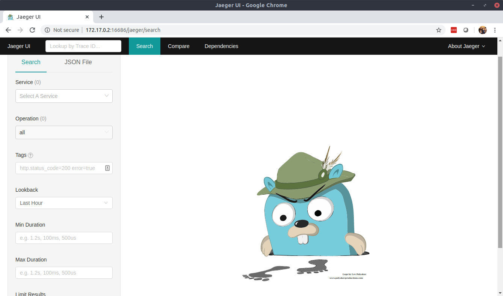
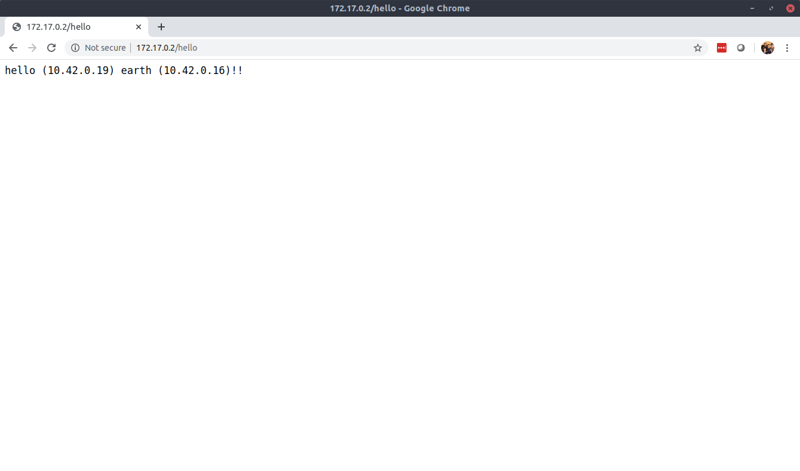
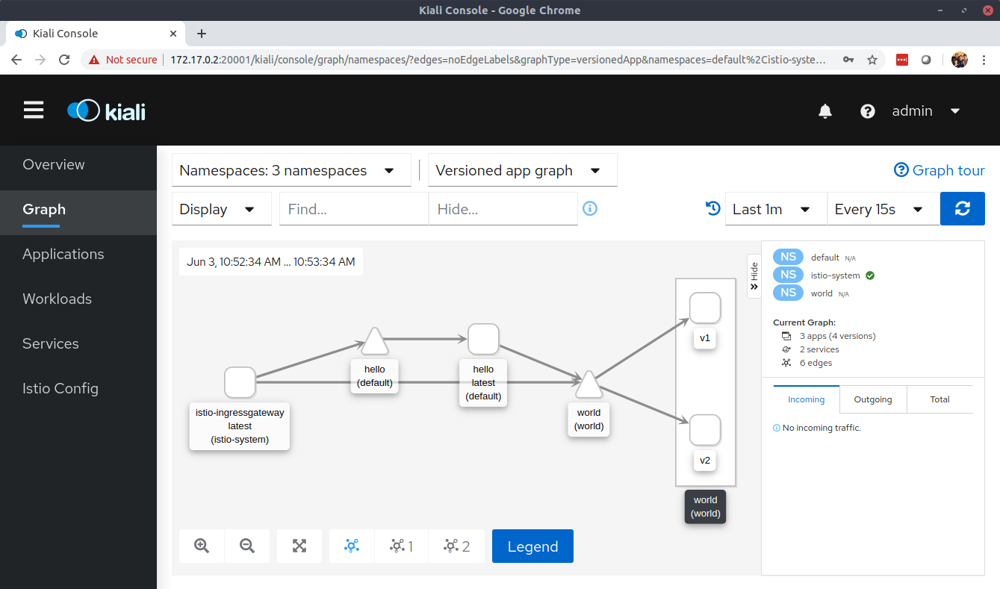

# Installing istio on k3s

## Setup k3s without installing traefik ingress controller
``` 
curl -sfL https://get.k3s.io |INSTALL_K3S_EXEC="--no-deploy traefik" sh -

export KUBECONFIG=/etc/rancher/k3s/k3s.yaml 
```

## Validate
```
[root@ae2daa982440f3ee ~]# kubectl get po --all-namespaces
NAMESPACE     NAME                                     READY   STATUS    RESTARTS   AGE
kube-system   metrics-server-7566d596c8-phxdz          1/1     Running   0          4m47s
kube-system   local-path-provisioner-6d59f47c7-tldnw   1/1     Running   0          4m47s
kube-system   coredns-8655855d6-4bp2r                  1/1     Running   0          4m47s
```

## Download istio
 ```
curl -L https://istio.io/downloadIstio | sh -
 ```

## Install using demo profile
```
export PATH="$PATH:/root/istio-1.6.0/bin"
istioctl manifest apply --set profile=demo

[root@ae2daa982440f3ee ~]# kubectl get po -n istio-system
NAME                                    READY   STATUS    RESTARTS   AGE
istiod-85d7db7d57-7h59z                 1/1     Running   0          103s
svclb-istio-ingressgateway-lj67m        5/5     Running   0          92s
istio-tracing-9dd6c4f7c-fmhz6           1/1     Running   0          92s
istio-ingressgateway-7d8cdc4ddc-fml8j   1/1     Running   0          93s
istio-egressgateway-f97cf498c-n6p4m     1/1     Running   0          93s
grafana-54b54568fc-tbgkv                1/1     Running   0          92s
prometheus-5bb9c77d74-tspk2             2/2     Running   0          92s
kiali-d45468dc4-cs4c8                   1/1     Running   0          92s
[root@ae2daa982440f3ee ~]# 
```

## Expose kiali by changing its service definition from ClusterIP to LoadBalancer
```
kubectl edit svc kiali -n istio-system

[root@ae2daa982440f3ee ~]# kubectl get svc kiali -n istio-system
NAME    TYPE           CLUSTER-IP    EXTERNAL-IP   PORT(S)           AGE
kiali   LoadBalancer   10.43.39.42   172.17.0.2    20001:32321/TCP   6m8s

```


## Expose Grafana as well as jaeger query service
```
kubectl edit svc grafana -n istio-system

kubectl edit svc jaeger-query -n istio-system
```




## Test by creating and annotating namespaces and deploying some apps

```
kubectl label namespace default istio-injection=enabled

yum install -y git

git clone https://github.com/awiradarma/service-mesh

cd service-mesh/multiproject_istio

kubectl create ns world

kubectl label namespace world istio-injection=enabled

kubectl apply -f world.yml -n world

kubectl apply -f ingress_world.yml -n world

[root@ae2daa982440f3ee multiproject_istio]# kubectl get po -n world
NAME                        READY   STATUS    RESTARTS   AGE
world-v2-b479d797c-wht7g    2/2     Running   0          33s
world-v1-66dfc948fb-mc27z   2/2     Running   0          33s

kubectl apply -f hello.yml -n default

[root@ae2daa982440f3ee multiproject_istio]# kubectl get po -n default
NAME                     READY   STATUS    RESTARTS   AGE
hello-785d64b5d6-wvqkf   2/2     Running   0          30s
hello-785d64b5d6-5n4lr   2/2     Running   0          30s

kubectl apply -f ingress_hello.yml -n default


```
## You should now be able to hit the hello service via istio ingress gateway



## And the interaction should be visible from kiali (use admin/admin to login)


