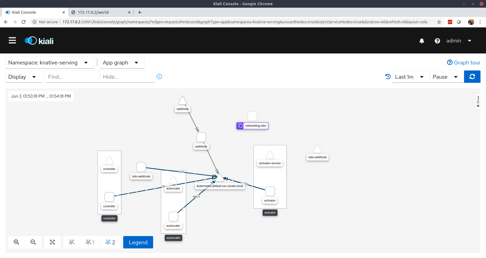
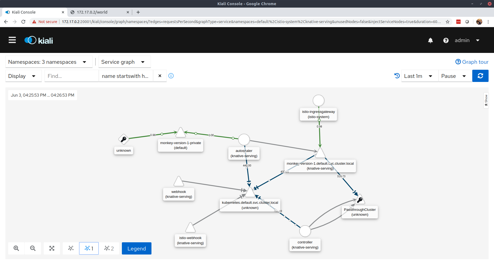
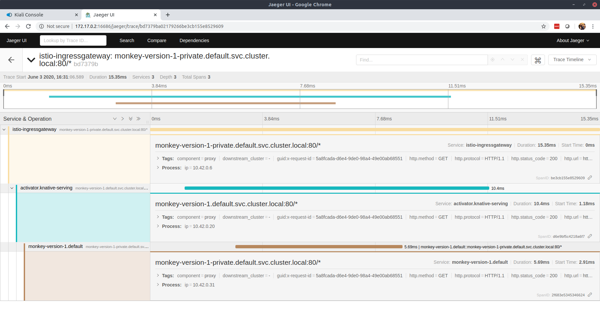

# Installing knative serving on k3s
## Follow [istio installation steps](../istio/README.md) first
## Install knative serving components (see knative.dev)
```
kubectl apply --filename https://github.com/knative/serving/releases/download/v0.14.0/serving-crds.yaml

kubectl apply --filename https://github.com/knative/serving/releases/download/v0.14.0/serving-core.yaml

kubectl apply --filename https://github.com/knative/net-istio/releases/download/v0.14.0/release.yaml

[root@58b1ba6fe9425f26 multiproject_istio]# kubectl get po -n knative-serving
NAME                                READY   STATUS    RESTARTS   AGE
autoscaler-c6f75f5f4-2wb76          2/2     Running   0          14m
webhook-7b688c478f-x96qs            2/2     Running   0          14m
controller-5dd9c9f5-h2thz           2/2     Running   1          14m
activator-6f5d97f57b-n5hjs          2/2     Running   0          14m
networking-istio-854c88cfb9-jq6rg   1/1     Running   0          8s
istio-webhook-749b694d45-4qrfq      1/2     Running   0          8s

```




## Install a few examples

```
kubectl apply -f monkey.yaml


[root@58b1ba6fe9425f26 multiproject_istio]# kubectl get ksvc
NAME     URL                                 LATESTCREATED      LATESTREADY        READY   REASON
monkey   http://monkey.default.example.com   monkey-version-1   monkey-version-1   True    
[root@58b1ba6fe9425f26 multiproject_istio]# 


[root@58b1ba6fe9425f26 multiproject_istio]# kubectl get ksvc
NAME     URL                                 LATESTCREATED      LATESTREADY        READY   REASON
monkey   http://monkey.default.example.com   monkey-version-1   monkey-version-1   True    


```

## Hit the URL from another computer
```
$ curl -v -H "Host: monkey.default.example.com" http://172.17.0.2/greeting
*   Trying 172.17.0.2...
* TCP_NODELAY set
* Connected to 172.17.0.2 (172.17.0.2) port 80 (#0)
> GET /greeting HTTP/1.1
> Host: monkey.default.example.com
> User-Agent: curl/7.58.0
> Accept: */*
> 
< HTTP/1.1 200 OK
< content-length: 70
< content-type: text/plain;charset=UTF-8
< date: Wed, 03 Jun 2020 21:13:20 GMT
< server: istio-envoy
< x-envoy-upstream-service-time: 6059
< 
* Connection #0 to host 172.17.0.2 left intact
Monkey v1 ( monkey-version-1-deployment-6f6546d4df-n4qnb/10.42.0.28 ) 
```

## Check to see that the pod is now running
```
[root@58b1ba6fe9425f26 multiproject_istio]# kubectl get po -n default
NAME                                           READY   STATUS    RESTARTS   AGE
monkey-version-1-deployment-6f6546d4df-lf88h   3/3     Running   0          26s

```

## Visualize using kiali


## Check the call path using jaeger

