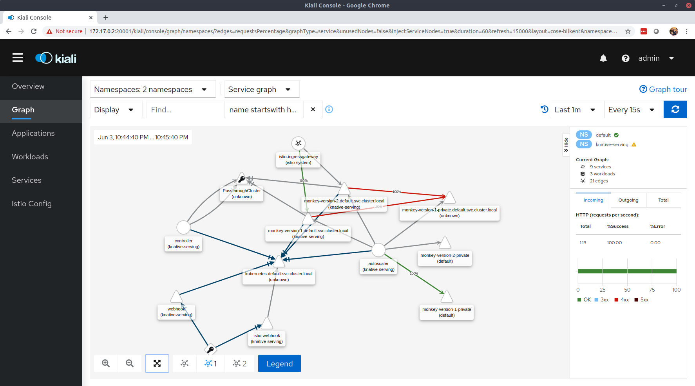

# Installing knative serving on k3s
## Follow [istio installation steps](../istio/README.md) first
## Install knative serving components (see knative.dev)
```
kubectl apply --filename https://github.com/knative/serving/releases/download/v0.14.0/serving-crds.yaml

kubectl apply --filename https://github.com/knative/serving/releases/download/v0.14.0/serving-core.yaml

kubectl apply --filename https://github.com/knative/net-istio/releases/download/v0.14.0/release.yaml

[root@58b1ba6fe9425f26 multiproject_istio]# kubectl get po -n knative-serving
NAME                                READY   STATUS    RESTARTS   AGE
autoscaler-c6f75f5f4-2wb76          2/2     Running   0          14m
webhook-7b688c478f-x96qs            2/2     Running   0          14m
controller-5dd9c9f5-h2thz           2/2     Running   1          14m
activator-6f5d97f57b-n5hjs          2/2     Running   0          14m
networking-istio-854c88cfb9-jq6rg   1/1     Running   0          8s
istio-webhook-749b694d45-4qrfq      1/2     Running   0          8s

```


## Install a few examples

```
kubectl apply -f monkey.yaml


[root@58b1ba6fe9425f26 multiproject_istio]# kubectl get ksvc
NAME     URL                                 LATESTCREATED      LATESTREADY        READY   REASON
monkey   http://monkey.default.example.com   monkey-version-1   monkey-version-1   True    
[root@58b1ba6fe9425f26 multiproject_istio]# 


[root@58b1ba6fe9425f26 multiproject_istio]# kubectl get ksvc
NAME     URL                                 LATESTCREATED      LATESTREADY        READY   REASON
monkey   http://monkey.default.example.com   monkey-version-1   monkey-version-1   True    


```

## Hit the URL from another computer
```
$ curl -v -H "Host: monkey.default.example.com" http://172.17.0.2/greeting
*   Trying 172.17.0.2...
* TCP_NODELAY set
* Connected to 172.17.0.2 (172.17.0.2) port 80 (#0)
> GET /greeting HTTP/1.1
> Host: monkey.default.example.com
> User-Agent: curl/7.58.0
> Accept: */*
> 
< HTTP/1.1 200 OK
< content-length: 70
< content-type: text/plain;charset=UTF-8
< date: Wed, 03 Jun 2020 21:13:20 GMT
< server: istio-envoy
< x-envoy-upstream-service-time: 6059
< 
* Connection #0 to host 172.17.0.2 left intact
Monkey v1 ( monkey-version-1-deployment-6f6546d4df-n4qnb/10.42.0.28 ) 
```

## Check to see that the pod is now running
```
[root@58b1ba6fe9425f26 multiproject_istio]# kubectl get po -n default
NAME                                           READY   STATUS    RESTARTS   AGE
monkey-version-1-deployment-6f6546d4df-lf88h   3/3     Running   0          26s

```

## Visualize using kiali


## Check the call path using jaeger


## Deploy a second version of the application
```
kubectl apply -f monkey2.yaml
```

## Check the config, service and route objects created
```
[root@58b1ba6fe9425f26 multiproject_istio]# kubectl get config
NAME     LATESTCREATED      LATESTREADY        READY   REASON
monkey   monkey-version-2   monkey-version-2   True    

[root@58b1ba6fe9425f26 multiproject_istio]# kubectl get svc
NAME                       TYPE           CLUSTER-IP      EXTERNAL-IP                                            PORT(S)                             AGE
kubernetes                 ClusterIP      10.43.0.1       <none>                                                 443/TCP                             9h
hello                      ClusterIP      10.43.19.66     <none>                                                 80/TCP                              9h
monkey-version-1-private   ClusterIP      10.43.205.11    <none>                                                 80/TCP,9090/TCP,9091/TCP,8022/TCP   7h26m
monkey-version-1           ClusterIP      10.43.106.198   <none>                                                 80/TCP                              7h26m
current-monkey             ExternalName   <none>          cluster-local-gateway.istio-system.svc.cluster.local   <none>                              7h26m
monkey                     ExternalName   <none>          cluster-local-gateway.istio-system.svc.cluster.local   <none>                              7h26m
latest-monkey              ExternalName   <none>          cluster-local-gateway.istio-system.svc.cluster.local   <none>                              7h26m
monkey-version-2-private   ClusterIP      10.43.27.32     <none>                                                 80/TCP,9090/TCP,9091/TCP,8022/TCP   18m
monkey-version-2           ClusterIP      10.43.232.43    <none>                                                 80/TCP                              18m


kubectl get route -o yaml

...
    traffic:
    - latestRevision: false
      percent: 100
      revisionName: monkey-version-1
      tag: current
      url: http://current-monkey.default.example.com
    - latestRevision: true
      percent: 0
      revisionName: monkey-version-2
      tag: latest
      url: http://latest-monkey.default.example.com
    url: http://monkey.default.example.com
kind: List
metadata:
  resourceVersion: ""
  selfLink: ""
[root@58b1ba6fe9425f26 multiproject_istio]# 

```

## Invoke the current and the new version from a different host

```
$ curl -H "Host: monkey.default.example.com" http://172.17.0.2/greeting
Monkey v1 ( monkey-version-1-deployment-6f6546d4df-2t82r/10.42.0.39 )  
$ 
$ curl -H "Host: current-monkey.default.example.com" http://172.17.0.2/greeting
Monkey v1 ( monkey-version-1-deployment-6f6546d4df-2t82r/10.42.0.39 )  
$ 
$ curl -H "Host: latest-monkey.default.example.com" http://172.17.0.2/greeting
Monkey v2 ( monkey-version-2-deployment-b56f965f4-p5fkr/10.42.0.40 )  
$ 


```

## Check that the pods are now running
```
[root@58b1ba6fe9425f26 multiproject_istio]# kubectl get po
NAME                                           READY   STATUS    RESTARTS   AGE
hello-785d64b5d6-565l4                         2/2     Running   0          9h
hello-785d64b5d6-fs66z                         2/2     Running   0          9h
monkey-version-1-deployment-6f6546d4df-2t82r   3/3     Running   0          45s
monkey-version-2-deployment-b56f965f4-p5fkr    3/3     Running   0          13s

```

## Check the traffic visualization in kiali


